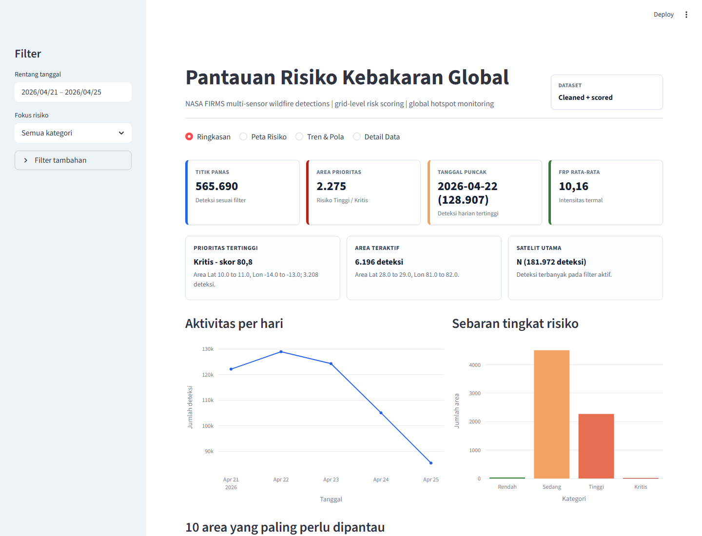

# Global Wildfire Risk Intelligence Dashboard

## English

This project analyzes global wildfire hotspot detections from NASA FIRMS and converts them into a grid-based wildfire risk dashboard. Instead of only plotting fire points on a map, the project summarizes active areas, daily trends, thermal intensity, sensor coverage, and monitoring priorities.

I built this as a data analytics and geospatial analytics portfolio project, covering data cleaning, exploratory analysis, spatial aggregation, risk scoring, and a reproducible Streamlit dashboard.

### Why This Project

Satellite hotspot datasets can quickly become crowded point maps. To make the data easier to analyze, this project turns raw detections into:

- high-activity wildfire areas,
- daily detection trends,
- satellite and sensor comparisons,
- FRP and brightness-based thermal indicators,
- a consistent risk score for each grid area.

The final dashboard helps identify monitoring priorities without manually scanning hundreds of thousands of raw records.

### Dataset

Full dataset: [NASA FIRMS Multi-Sensor Global Wildfire Detections](https://www.kaggle.com/datasets/sarcasmos/nasa-firms-multi-sensor-global-wildfire-detections) from Kaggle.

Local full-data profile:

- Raw records: 565,708
- Clean records: 565,690
- Removed duplicates: 18
- Date range: 2026-04-21 00:01 UTC to 2026-04-25 20:28 UTC
- Instruments: VIIRS 535,025 detections, MODIS 30,665 detections
- Day/night split: 413,582 day detections and 152,108 night detections

Reproducibility note:

- The full CSV is not stored in this repository because of its size.
- A small demo dataset is included at `data/sample/wildfire_sample.csv`.
- For the full analysis, download the Kaggle dataset and place the CSV in `data/raw/nasa_firms_multisensor_2026.csv`, then rebuild the outputs.

### Workflow

1. Inspect raw schema and missing values.
2. Standardize FIRMS column names.
3. Parse acquisition date and time into timestamp fields.
4. Validate latitude and longitude.
5. Normalize confidence, FRP, and brightness across sensors.
6. Aggregate fire detections into 1-degree latitude-longitude grids.
7. Calculate a 0-100 wildfire risk score.
8. Present results through notebooks and a Streamlit dashboard.

### Risk Scoring

Risk score is calculated per 1-degree latitude-longitude grid.

| Component | Weight |
|---|---:|
| Hotspot density | 35% |
| Average FRP | 20% |
| Average brightness | 15% |
| Average confidence | 15% |
| Recent activity | 15% |

Risk categories:

| Score | Category |
|---:|---|
| 0-25 | Low |
| 26-50 | Medium |
| 51-75 | High |
| 76-100 | Critical |

If a metric is unavailable in a dataset, the scoring function uses the remaining available components.

### Key Results

- Peak detections occurred on 2026-04-22 with 128,907 detections.
- VIIRS contributed most records, with 535,025 detections.
- The 0-30N latitude band had the highest detection volume: 350,120 records.
- Daytime detections were higher than nighttime detections in this data window.
- Highest-risk grid: `Lat 10.0 to 11.0, Lon -14.0 to -13.0`.
- Highest risk score: 80.84, categorized as Critical.
- Priority areas: 6 Critical grids and 2,269 High-risk grids.

### Dashboard

The Streamlit dashboard includes:

- KPI cards for total hotspots, priority areas, peak date, and average FRP.
- A lightweight global risk map using aggregated grid-level data.
- Daily hotspot trend.
- Risk category distribution.
- Top priority area ranking.
- Filters for date, risk category, FRP, satellite, instrument, confidence, and day/night.
- Filtered risk score export.

Dashboard preview:



### Project Structure

```text
wildfire-risk-intelligence/
|-- app/
|   `-- streamlit_app.py
|-- assets/
|   `-- dashboard_preview.png
|-- data/
|   |-- raw/
|   |   `-- nasa_firms_multisensor_2026.csv        # optional full dataset
|   |-- sample/
|   |   `-- wildfire_sample.csv                    # small demo dataset
|   `-- processed/
|       |-- cleaned_wildfire_data.csv              # generated
|       `-- wildfire_risk_scores.csv               # generated
|-- notebooks/
|   |-- 01_data_cleaning.ipynb
|   |-- 02_exploratory_data_analysis.ipynb
|   |-- 03_geospatial_analysis.ipynb
|   `-- 04_wildfire_risk_scoring.ipynb
|-- reports/
|   |-- data_profile.json
|   `-- executive_summary.md
|-- src/
|   |-- data_utils.py
|   |-- geo_utils.py
|   |-- risk_model.py
|   |-- build_outputs.py
|   `-- create_notebooks.py
|-- requirements.txt
`-- README.md
```

### How to Run

Install dependencies:

```bash
pip install -r requirements.txt
```

Build cleaned data and risk scores:

```bash
python src/build_outputs.py
```

Run the dashboard:

```bash
streamlit run app/streamlit_app.py
```

If `data/raw/` is empty, the pipeline uses the sample dataset in `data/sample/`. For the full analysis, download the Kaggle CSV and place it in `data/raw/`.

### Notebooks

- `01_data_cleaning.ipynb`: schema inspection, validation, and cleaning.
- `02_exploratory_data_analysis.ipynb`: trend, confidence, FRP, satellite, and day/night analysis.
- `03_geospatial_analysis.ipynb`: grid aggregation and hotspot density analysis.
- `04_wildfire_risk_scoring.ipynb`: scoring method, ranking, and risk map.

### Limitations

- The risk score is an observed activity index, not a fire prediction model.
- The current full dataset covers 2026-04-21 to 2026-04-25 UTC.
- Grid-based ranking does not replace administrative boundary analysis.
- Satellite detections can be affected by overpass timing, cloud cover, sensor type, and detection algorithm.
- Weather, land cover, fuel moisture, and population exposure are not included yet.

### Next Improvements

- Add country or province boundaries for clearer regional summaries.
- Add a longer historical baseline for anomaly detection.
- Add weather and vegetation variables for predictive modeling.
- Add automated report export from the dashboard.

---

## Bahasa Indonesia

Project ini menganalisis data deteksi titik panas global dari NASA FIRMS dan mengubahnya menjadi dashboard risiko kebakaran berbasis grid. Fokusnya bukan hanya menampilkan titik api di peta, tetapi merangkum area yang paling aktif, tren harian, intensitas termal, cakupan sensor, dan prioritas pemantauan.

Project ini dibuat sebagai portfolio data analytics dan geospatial analytics, mulai dari data cleaning, eksplorasi data, agregasi spasial, risk scoring, sampai dashboard Streamlit yang bisa dijalankan ulang.

### Alasan Project

Dataset hotspot satelit biasanya besar dan mudah menjadi peta titik yang terlalu ramai. Agar lebih mudah dianalisis, project ini mengubah data mentah menjadi:

- area dengan aktivitas kebakaran tertinggi,
- tren deteksi harian,
- perbandingan satelit dan sensor,
- indikator panas berbasis FRP dan brightness,
- skor risiko yang konsisten untuk setiap area grid.

Dashboard akhirnya membantu melihat area prioritas tanpa harus membaca ratusan ribu baris data mentah.

### Dataset

Dataset penuh: [NASA FIRMS Multi-Sensor Global Wildfire Detections](https://www.kaggle.com/datasets/sarcasmos/nasa-firms-multi-sensor-global-wildfire-detections) dari Kaggle.

Profil data penuh yang dianalisis secara lokal:

- Raw records: 565,708
- Clean records: 565,690
- Duplikasi yang dihapus: 18
- Rentang tanggal: 2026-04-21 00:01 UTC sampai 2026-04-25 20:28 UTC
- Instrumen: VIIRS 535,025 deteksi, MODIS 30,665 deteksi
- Siang/malam: 413,582 deteksi siang dan 152,108 deteksi malam

Catatan reproducibility:

- Full CSV tidak disimpan di repository karena ukurannya besar.
- Sample kecil tersedia di `data/sample/wildfire_sample.csv`.
- Untuk analisis penuh, download dataset Kaggle dan letakkan CSV di `data/raw/nasa_firms_multisensor_2026.csv`, lalu jalankan ulang pipeline.

### Workflow

1. Inspect schema mentah dan missing values.
2. Standardisasi nama kolom FIRMS.
3. Parse tanggal dan waktu akuisisi menjadi timestamp.
4. Validasi latitude dan longitude.
5. Normalisasi confidence, FRP, dan brightness antar-sensor.
6. Agregasi titik panas ke grid latitude-longitude 1 derajat.
7. Hitung wildfire risk score 0-100.
8. Sajikan hasil lewat notebook dan dashboard Streamlit.

### Risk Scoring

Risk score dihitung per grid latitude-longitude 1 derajat.

| Komponen | Bobot |
|---|---:|
| Hotspot density | 35% |
| Average FRP | 20% |
| Average brightness | 15% |
| Average confidence | 15% |
| Recent activity | 15% |

Kategori risiko:

| Skor | Kategori |
|---:|---|
| 0-25 | Low |
| 26-50 | Medium |
| 51-75 | High |
| 76-100 | Critical |

Jika ada metrik yang tidak tersedia, fungsi scoring otomatis memakai komponen lain yang tersedia.

### Hasil Utama

- Puncak deteksi terjadi pada 2026-04-22 dengan 128,907 deteksi.
- VIIRS menyumbang mayoritas data, yaitu 535,025 deteksi.
- Latitude band 0-30N memiliki volume deteksi terbesar: 350,120 records.
- Deteksi siang lebih banyak dibanding deteksi malam pada window data ini.
- Grid risiko tertinggi: `Lat 10.0 to 11.0, Lon -14.0 to -13.0`.
- Skor risiko tertinggi: 80.84, kategori Critical.
- Area prioritas: 6 grid Critical dan 2,269 grid High-risk.

### Dashboard

Dashboard Streamlit berisi:

- KPI untuk total titik panas, area prioritas, tanggal puncak, dan rata-rata FRP.
- Peta risiko global ringan berbasis data agregat per grid.
- Tren harian deteksi titik panas.
- Distribusi kategori risiko.
- Ranking area prioritas.
- Filter tanggal, kategori risiko, FRP, satelit, instrument, confidence, dan day/night.
- Export risk score sesuai filter.

Preview dashboard:


### Cara Menjalankan

Install dependencies:

```bash
pip install -r requirements.txt
```

Build cleaned data dan risk scores:

```bash
python src/build_outputs.py
```

Run dashboard:

```bash
streamlit run app/streamlit_app.py
```

Jika `data/raw/` kosong, pipeline akan memakai sample dataset di `data/sample/`. Untuk analisis penuh, download CSV dari Kaggle dan letakkan di `data/raw/`.

### Limitasi

- Risk score adalah indeks aktivitas observasi, bukan model prediksi kebakaran.
- Dataset penuh saat ini mencakup 2026-04-21 sampai 2026-04-25 UTC.
- Ranking grid belum menggantikan analisis batas administratif.
- Deteksi satelit bisa dipengaruhi waktu overpass, cloud cover, jenis sensor, dan algoritma deteksi.
- Weather, land cover, fuel moisture, dan population exposure belum masuk ke model.

### Pengembangan Berikutnya

- Menambahkan batas negara/provinsi untuk ringkasan regional.
- Menambahkan baseline historis yang lebih panjang untuk anomaly detection.
- Menambahkan variabel cuaca dan vegetasi untuk predictive modeling.
- Menambahkan automated report export dari dashboard.

## Author

Muhammad Dani Nasution

- LinkedIn: [muhammad-dani-nasution](https://www.linkedin.com/in/muhammad-dani-nasution/)
- Instagram: [@danasty29](https://www.instagram.com/danasty29/)
